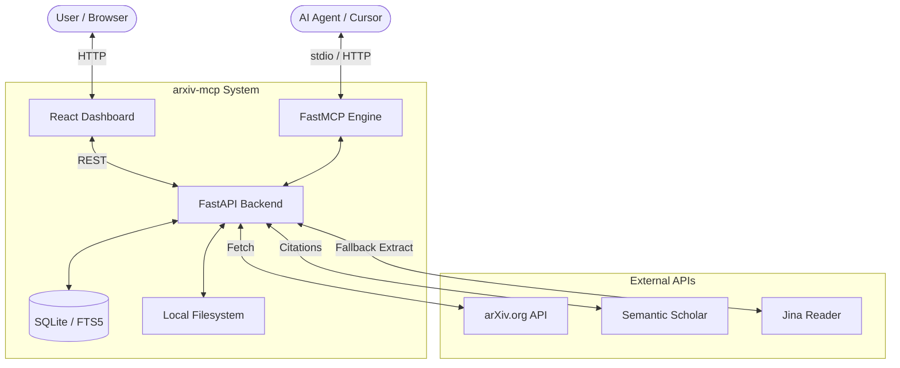

# Architecture Overview

**arxiv-mcp** is a dual-purpose system: a robust **MCP Server** for AI agents and a **Web Dashboard** for human researchers.

## High-Level Components

### 1. Backend (Python)
- **FastAPI**: Provides the RESTful endpoints for the dashboard and the ASGI mounting point for the MCP server.
- **FastMCP**: Orchestrates the tools, prompts, and skills. It handles both `stdio` and `SSE` (Streamable HTTP) transports.
- **Async Workflow**: All network calls to arXiv and Semantic Scholar are performed asynchronously using `httpx`.

### 2. Frontend (React)
- **Vite**: Used for bundling and fast development.
- **Tailwind CSS**: Powering the modern, responsive UI with HSL-based colors and glassmorphism.
- **State Management**: Uses local storage for search history and favorites to minimize backend complexity.

### 3. Storage Layer
- **SQLite FTS5**: Used for the "Depot". When a paper's full text is ingested, it is chunked and indexed for high-speed keyword search (`BM25`).
- **Markdown Files**: The raw ingested text is stored as `.md` files in the `data_dir` for easy access by other tools.

## Data Flow: Fetching a Paper
1. **Request**: User clicks "Ingest" or an agent calls `ingest_paper_to_corpus`.
2. **HTML Extraction**: The backend checks if **arXiv Experimental HTML** is available for that ID.
3. **Conversion**: If available, HTML is converted to Markdown using BeautifulSoup and html2text.
4. **Fallback**: If HTML is missing, it falls back to Jina Reader or prompts the user for external PDF access.
5. **Persistence**: Metadata is saved to SQLite, and content is indexed in FTS5.
6. **Response**: The rich Markdown content is returned.

## REST API (Reference)

| Endpoint | Method | Description |
| :--- | :--- | :--- |
| `/api/health` | GET | Liveness check. |
| `/api/stats` | GET | Depot counts and storage path. |
| `/api/search` | GET | Search arXiv with metadata filters. |
| `/api/paper` | GET | Fetch metadata for a specific ID. |
| `/api/depot/search`| GET | Keyword search across local corpus. |
| `/api/depot/ingest`| POST | Ingest a paper by ID. |
| `/mcp` | ALL | MCP HTTP endpoint (SSE). |
